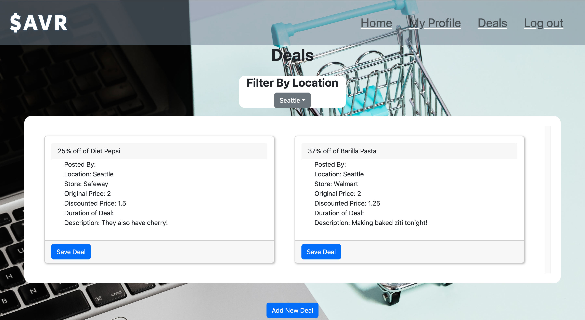
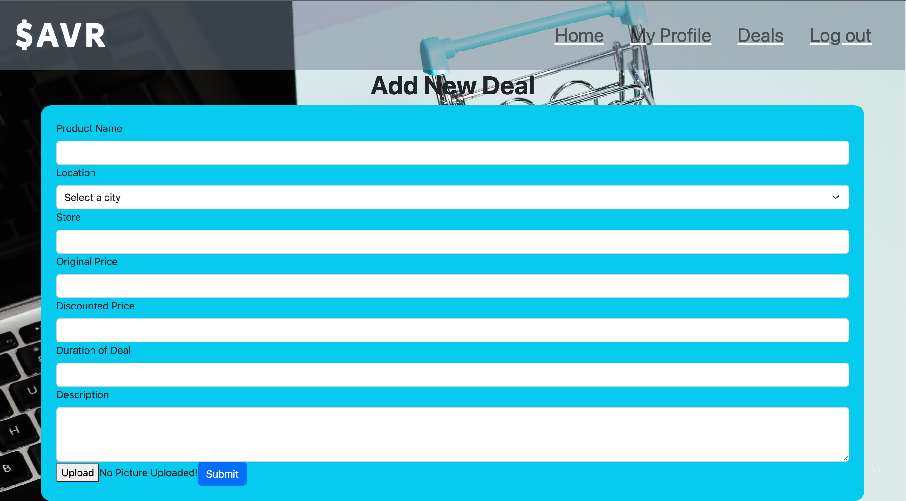
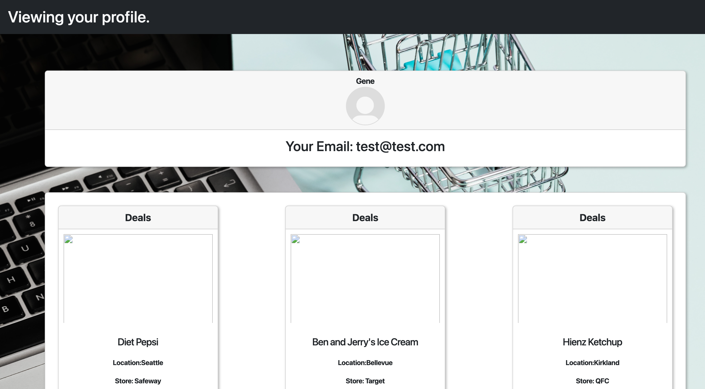

# SAVR
A place for communities in the greater Seattle area to share local deals and savings

## Table of Contents
- [Description](#description)
- [Deployed Link](#deployed-link) 
- [Usage](#usage)
- [Built with](#built-with)
- [Credits](#credits)

## Description
For our group's final project we used our knowledge of MongoDB, Express, React, and Node to create SAVR. SAVR is an application where users from the greater Seattle area can sign up and share local deals that they find with other members of their community. 

## Deployed Link 
Heroku: [SAVR]()

## Usage
Welcome to SAVR! In order to use the application first click 'Signup' on the top right menu to create a new account or 'Login' if you are an existing user.

On the signup page create a username and password and enter a valid email address to set up a new account. You can also upload a profile image of your choice.

Once your account is created you can log in using the credentials you set up.

After logging in, select the 'Deals' option to view deals and savings shared by the community. Here you can also filter deals by location based on the city you are planning to shop at. You can also click 'Save Deal' on indivdual deals that you are interested in and view them later on your profile page. If you would like to share a new deal with other members click the 'Add New Deal' button on the bottom of the page.

Upon clicking 'Add New Deal' you will be taken to the page shown below where you can fill out the following fields to share a new deal with other members. Note that 'Product Name' 'Location' and 'Discounted Price' are fields required in order to successfully add a new deal. Go back to the 'Deals' page to view your new deal added to the shared list.

To view your saved deals click 'My Profile' where your uploaded profile image and saved deals will all be shown. You can remove any deals you are no longer interested as well.

## Built With
MongoDB, Express, React, Node, JSX, CSS, Bootstrap, Cloudinary, Animejs

## Credits
[Patrick Delaney](https://github.com/Pat-Delaney)

[Keng Fong](https://github.com/kenghoufong1)

[Miriam Silva](https://github.com/silvam22)

[Yuri Kwon](https://github.com/uriyuri00)

[Gene Kim](https://github.com/genedkim)

## License
N/A